<!-- banner -->


<p align="center">
  <b>A physics-informed engine for reference localization in periodic semiconductor inspection.</b><br>
  PS2 · Applied Materials · Semicon India Hackathon
</p>

<p align="center">
  
  
  
  
  
</p>

---

## TL;DR

Given a small **reference patch** and a **1000×1000 SEM search image** of a
repetitive wafer (DRAM / FinFET), predict where the reference sits: `(x, y)`.
Because the structure is periodic, **hundreds of locations look identical** and
classical template matching locks onto the wrong copy.

Drift-Sense reframes this as **two different information problems** and solves
each with the right physics — no neural network:

|  | Question | Method | Result |
|--|----------|--------|--------|
| **Stage 2A** | *Where could it be?* | spectral lattice (FFT) | recall **77.5% → 100%** (hard tier) |
| **Stage 2B** | *Which copy is it?* | persistent LER fingerprint | separation **d′ ≈ 4–5**, clean-tier **0% → 100%** |

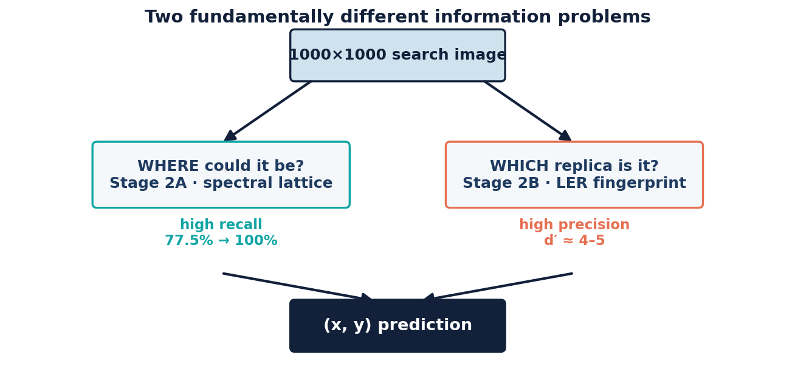

> **The one-line idea.** A perfectly periodic image is *information-theoretically*
> unsolvable. Real wafers aren't perfectly periodic — **line-edge roughness (LER)
> is a permanent physical property of the etched silicon**, so two separate scans
> see the *same* roughness plus independent noise. That makes LER a positional
> fingerprint. Frequency tells you *where a copy could be*; LER tells you *which
> copy is real*.

---

## Table of contents

- [Why this is hard](#why-this-is-hard)
- [Results at a glance](#results-at-a-glance)
- [The architecture](#the-architecture)
- [Contribution 1 — the synthetic data engine](#contribution-1--the-synthetic-data-engine)
- [The core insight (with a control)](#the-core-insight-with-a-control)
- [Why classical matching fails](#why-classical-matching-fails)
- [Stage 2B — LER discrimination](#stage-2b--ler-discrimination)
- [Stage 2A — spectral recall](#stage-2a--spectral-recall)
- [Stage 2D — the candidate-budget boundary](#stage-2d--the-candidate-budget-boundary)
- [Stage 2C/2E — distortion robustness](#stage-2c2e--distortion-robustness)
- [Quickstart](#quickstart)
- [Repository map](#repository-map)
- [Scientific method & honesty notes](#scientific-method--honesty-notes)
- [Roadmap](#roadmap)

---

## Why this is hard

Wafers are dense periodic arrays. DRAM appears as orthogonal or 6F²-staggered
grids; FinFET as high-frequency fins crossed by low-frequency gates. The 2-D
frequency signatures differ, but *within* an image the pattern repeats — so a
correlation matcher has hundreds of equally-good answers.

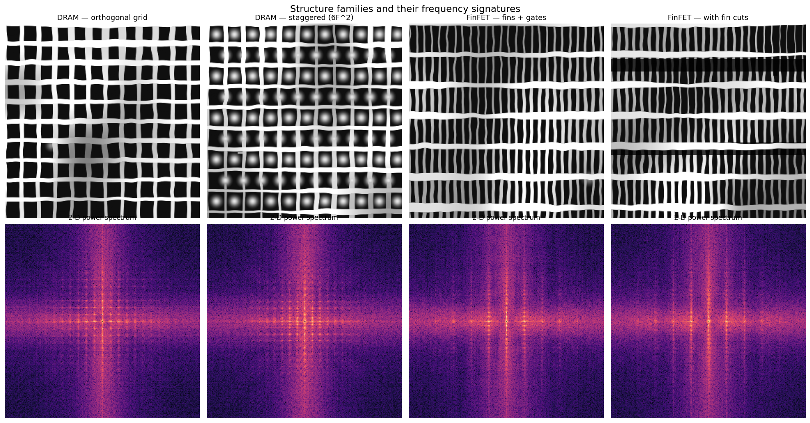

Applied Materials explicitly names periodic DRAM arrays and FinFET structures as
failure cases for template matching. No dataset is provided, so **we build the
simulator** — which turns dataset realism into a first-class, controllable part
of the solution.

---

## Results at a glance

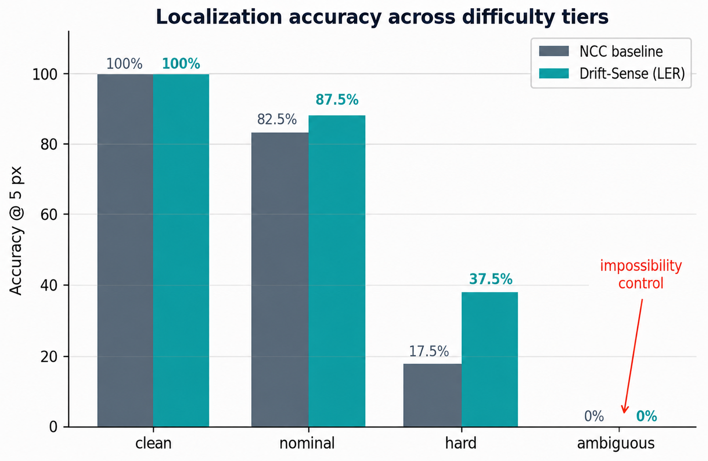

| Tier | What varies | NCC Acc@5 | **Drift-Sense Acc@5** | Recall@K |
|------|-------------|-----------|-----------------------|----------|
| `clean` | periodicity only | 100% | **100%** | 100% |
| `nominal` | ±1.5° rot, mild noise | 82.5% | **87.5%** | 100% |
| `hard` | ±5° rot, ±7% scale, low dose | 17.5% | **37.5%** | 100% |
| `ambiguous` | **physics removed (control)** | 0% | **0%** | — |

The `ambiguous` **0% is deliberate** — see [the control](#the-core-insight-with-a-control).

> **Scope note.** Hard-tier end-to-end numbers are measured on 12–15 pairs
> (treat ±10% as noise). Recall, period-estimation error, and descriptor-degradation
> curves are the statistically robust results. A held-out test set (`outputs/dataset_test/`,
> seed 9999) is generated and **sealed** — untouched until the pipeline is final.

---

## The architecture

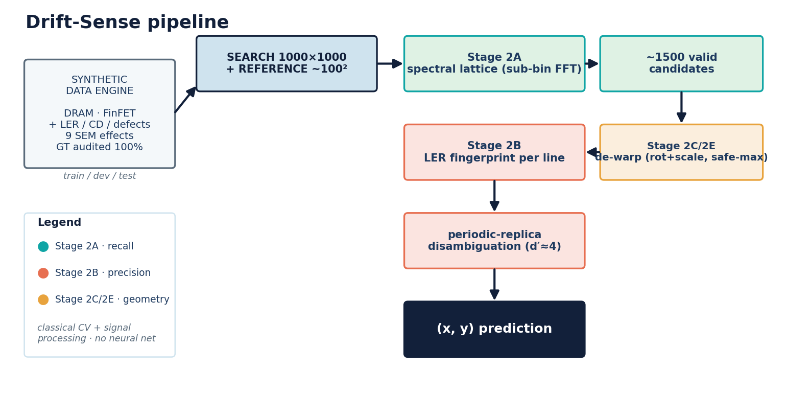

The system separates **recall** (get the truth into a small candidate set) from
**discrimination** (identify it among the candidates) — a decomposition that is
established *experimentally*, not assumed.

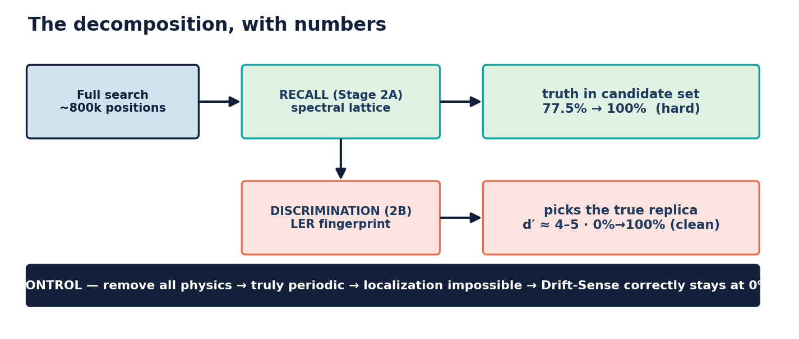

---

## Contribution 1 — the synthetic data engine

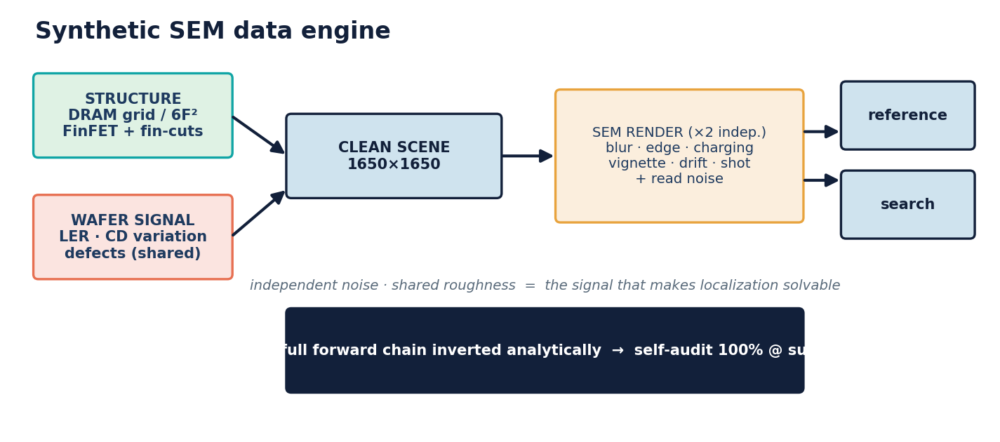

A physics-based SEM simulator with **known, audited** ground truth.

- **Structures** — DRAM grid / 6F² staggered / FinFET (+ fin-cuts), randomized pitch, phase, orientation.
- **Wafer signal (shared between scans)** — line-edge roughness, critical-dimension variation, defects.
- **9-stage SEM acquisition (independent per scan)** — beam blur, secondary-electron edge brightening, specimen charging, vignetting, scan drift, shot (Poisson) noise, read noise, photometric response, scan-line jitter. **Every effect cited** to the SEM/lithography literature.
- **Ground truth** — the full forward chain (drift shear → affine rotation/scale → crop) is inverted analytically, then **self-audited: 100% correct at sub-pixel across all four tiers.**


Two real bugs were found and fixed while hardening the engine — a line-rendering
geometry error (the generator produced no actual structure) and a ground truth
that ignored scan-drift shear. Both are now regression-tested.

---

## The core insight (with a control)

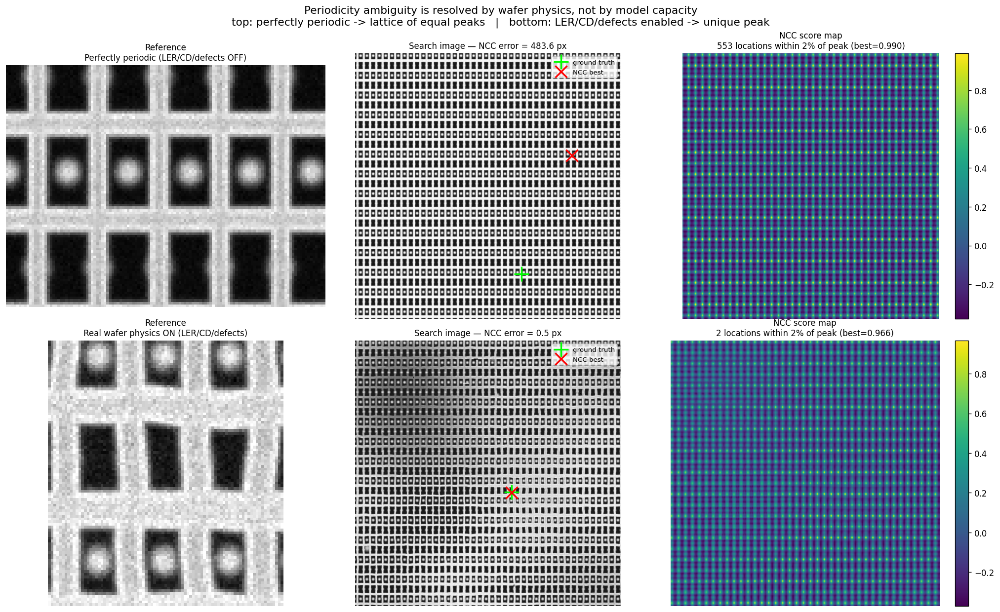

Two runs, **identical** noise/blur/geometry — the only difference is whether
wafer physics (LER/CD/defects) is enabled:

- **Perfectly periodic:** the NCC correlation surface has **553** locations within 2% of the peak — a lattice of equal answers.
- **Real physics on:** **2** — a single dominant peak at the truth.

This is why `ambiguous` scores **0%** and *should*: with the physics removed the
problem is genuinely impossible, and a method that scored above chance there
would be exploiting a generator artifact. Keeping this control proves the gains
are real.

---

## Why classical matching fails

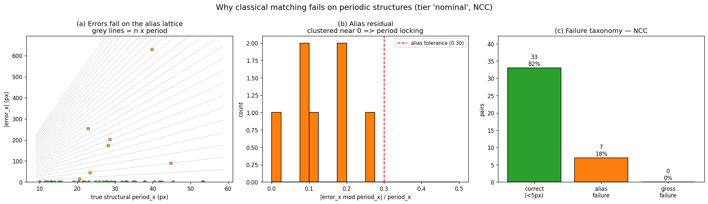

| Method | Mean err | Acc@5px | Acc@50px |
|--------|----------|---------|----------|
| NCC | 442 px | 0% | 7.5% |
| Phase correlation | 377 px | 0% | 2.5% |
| Multi-scale NCC | 442 px | 0% | 7.5% |

**100% of failures are period aliases** — the error is an exact integer multiple
of the structural pitch, not random noise. Proven by an error-vs-period analysis,
not asserted.

---

## Stage 2B — LER discrimination

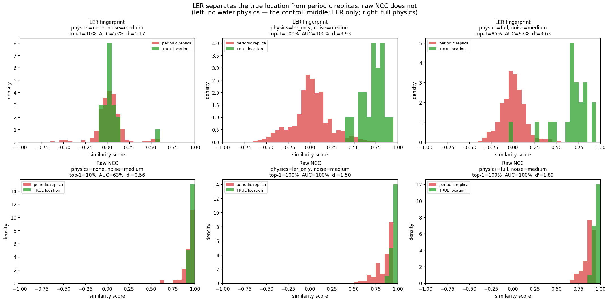

Switching LER on (and nothing else) moves replica discrimination from chance
(0–10%, chance = 4%) to **95–100%**, with **d′ ≈ 3.9–5.0** vs 1.1–1.5 for raw NCC.
The extractor recovers injected roughness at **correlation 0.997**, and still 0.89
at the harshest dose (25 e⁻/px).

Line correspondence is fixed by geometry and **never re-fit per candidate** — a
deliberate guard against silent re-alignment leakage.

---

## Stage 2A — spectral recall

The reference belongs to a periodic lattice, so it can only align at
lattice-consistent positions. A 2-D FFT recovers the reciprocal basis
(rotation-covariant — no separate orientation step).

**Diagnosed like an engineer:** FinFET recall failed because a global pitch model
drifts out of phase across 1000 px. The residual 0.6% pitch error was *pure FFT
bin quantization*; sub-bin peak refinement closed it (**0.6% → 0.09%**) and
hard-tier recall jumped **77.5% → 100%**.

> error budget → measurement → constraint → targeted fix

---

## Stage 2D — the candidate-budget boundary

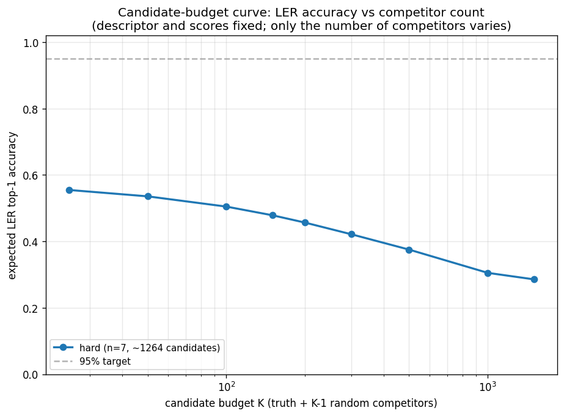

Shrinking the candidate set from 1500 → 25 nearly **doubles** accuracy
(29% → 55%): competitor count is first-order. But a *cheap* structural prefilter
is **provably impossible here** — all lattice candidates share one basis
(identical pitch and orientation by construction), so only position-dependent
signals differ, and **LER is the strongest of them**. This proves LER is not
merely sufficient but *necessary*.

---

## Stage 2C/2E — distortion robustness

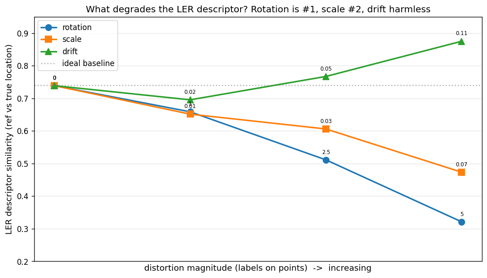

Measured, distortion by distortion: **rotation is the #1 descriptor degrader**
(0.74 → 0.32 at 5°), scale is #2, drift is harmless, noise moderate. A derived
error budget (0.79°, FinFET-limited) correctly predicts the ~2.5° break point.

The localizer applies a **safe** geometric correction: it scores each candidate
as `max(unwarped, dewarped)`, so a wrong rotation/scale estimate can only fail to
help — never regress (leakage-safe: one global transform for all candidates).
Hard tier **25% → 33%**; the oracle ceiling is 47%, with robust periodic-grid
orientation identified as the one open blocker.

---

## Quickstart

```bash
pip install -r requirements.txt

# 1) run the test suites (31 tests)
python -m tests.test_datagen
python -m tests.test_ler_fingerprint

# 2) generate the tiered dataset (DRAM+FinFET, 4 difficulty tiers)
python -m data_gen.dataset_gen --all --n_pairs 40 --seed 42

# 3) classical baseline + periodicity failure analysis
python -m experiments.run_baseline     --all_tiers
python -m experiments.analyze_failures --all_tiers --method NCC

# 4) Stage-2 experiments
python -m experiments.ler_hypothesis          # LER discrimination
python -m experiments.recall_study --all_tiers # spectral recall
python -m experiments.candidate_budget --tier hard
python -m experiments.descriptor_degradation
python -m experiments.rotation_study

# 5) qualitative figures
python -m data_gen.visualize --all --tier clean
```

---

## Repository map

```
DriftSense/
├── README.md                 ← you are here
├── config.py                 tier presets · all tunable physics in one place
├── stage2_config.py          FROZEN Stage-2B params + dataset split policy
├── requirements.txt
│
├── data_gen/                 THE DATA ENGINE
│   ├── structures.py         DRAM / FinFET generators + LER + defects
│   ├── sem_effects.py        9-stage SEM acquisition model (cited)
│   ├── scene_composer.py     exact-geometry pair composition + GT self-audit
│   ├── dataset_gen.py        tiered dataset driver
│   └── visualize.py          QC + presentation figures
│
├── localization/             THE LOCALIZER
│   ├── baseline.py           NCC · phase correlation · multi-scale pyramid
│   ├── ler_fingerprint.py    Stage 2B — per-line edge-roughness fingerprint
│   ├── spectral.py           Stage 2A/2C/2E — lattice, orientation, de-warp
│   ├── structural.py         Stage 2D — structural prefilter (studied, closed)
│   └── ler_localizer.py      two-stage localizer (candidates → LER → subpixel)
│
├── experiments/              REPRODUCIBLE STUDIES
│   ├── run_baseline.py            per-tier baseline metrics
│   ├── analyze_failures.py        alias-vs-gross failure taxonomy
│   ├── ler_hypothesis.py          the Stage-2 discrimination experiment
│   ├── ler_stress.py              margin vs distortion
│   ├── run_stage2.py              full-search Stage-2 evaluation
│   ├── recall_study.py            Stage 2A recall@K
│   ├── candidate_budget.py        Stage 2D budget curve
│   ├── descriptor_degradation.py  Stage 2E diagnosis
│   └── rotation_study.py          Stage 2C orientation
│
├── tests/                    31 correctness + regression tests
│   ├── test_datagen.py
│   └── test_ler_fingerprint.py
│
├── docs/
│   ├── images/               all figures + diagrams
│   ├── VIDEO_SCRIPT.md       narrated-video script + shot list
│   └── TECHNICAL_LOG.md      full stage-by-stage development log
│
└── outputs/                  generated datasets, metrics, figures, deck
    └── Drift-Sense_Round1.pptx
```

---

## Scientific method & honesty notes

This project is built the way a semiconductor algorithm team would work: every
claim is measured, controls are included, and **negative results are reported,
not hidden.**

- **A permanent impossibility control** (`ambiguous` tier) sits in every results table.
- **Provable boundaries** are stated where they exist (e.g. why a cheap prefilter cannot work).
- **Bugs found are documented** (line-rendering geometry; drift-shear ground truth; two sign-convention errors) with the regression tests that lock them out.
- **Parameters are frozen** (`stage2_config.py`) and a **held-out test set is sealed** before final evaluation, to avoid tuning on the test set.

The full stage-by-stage log, including the dead ends, is in
[`docs/TECHNICAL_LOG.md`](docs/TECHNICAL_LOG.md).

---

## Roadmap

| Stage | State |
|-------|-------|
| Data engine + baseline | ✅ done |
| 2B LER discrimination | ✅ frozen · d′ ≈ 4–5 |
| 2A Spectral recall | ✅ done · 77.5% → 100% |
| 2C Rotation estimation | ✅ meets 0.79° budget |
| 2D Structural prefilter | ✅ closed with a proof |
| 2E Distortion-robust LER | 🟡 safe de-warp 25→33%; robust grid orientation is next |
| 3 Unified full-search system | ⬜ next |
| 4 Held-out benchmark + ablations | ⬜ test set sealed, ready |

**Immediate next step:** a RANSAC / lattice-fit orientation estimator that is both
median-accurate *and* outlier-free, to capture the oracle 47% ceiling on the hard tier.

---

<p align="center"><i>Frequency tells you where a copy could be. LER tells you which copy is real.</i></p>
