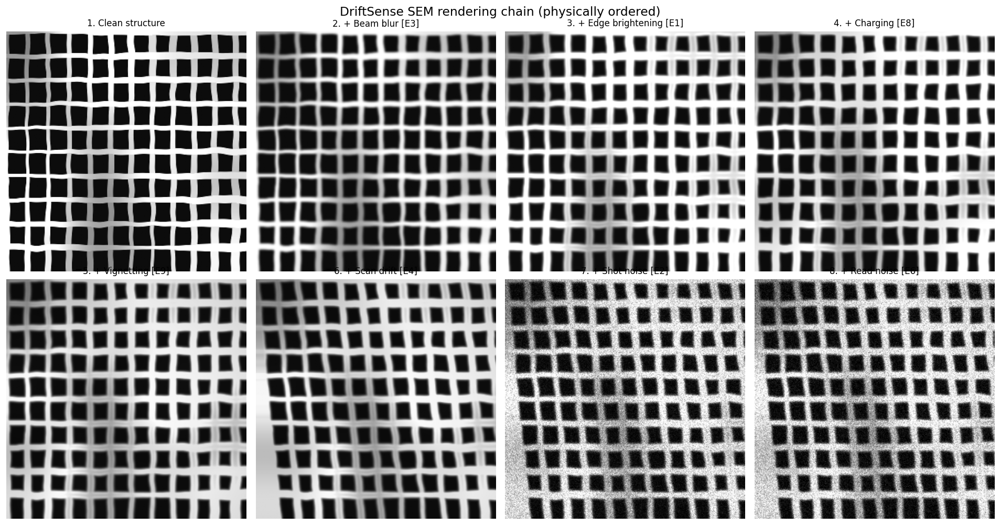

<<<<<<< HEAD
# DriftSense — PS2, Semicon India Hackathon

Reference-pattern localization in periodic semiconductor SEM imagery.
Given a small reference patch and a 1000×1000 search image, predict the
reference centre `(x, y)`.

**Stage 1 (this repo, complete):** a physics-based synthetic data engine, a
classical localization baseline, and a controlled failure analysis that
identifies *exactly* why classical template matching fails.

---

## The central finding

Classical matching does not fail randomly on these structures. **It fails by
locking onto the wrong period.**

| Tier | What changes | NCC median error | NCC Acc@5px | Failures that are period aliases |
|---|---|---|---|---|
| `clean` | no rotation/scale, low noise | **0.3 px** | **100.0%** | — (no failures) |
| `nominal` | ±1.5°, ±1.5% scale, mixed noise | 0.4 px | 82.5% | **100%** |
| `hard` | ±5°, ±7% scale, heavy drift, low dose | 360.6 px | 17.5% | 45% |
| `ambiguous` | **wafer physics disabled** | 347.6 px | **0.0%** | **100%** |

`clean` and `ambiguous` use *identical* noise, blur and geometry settings.
The only difference is whether line-edge roughness, CD variation and defects
are enabled. That single change moves NCC from **100% → 0%**.

Measured on the same image pair:

- perfectly periodic scene → **553** locations within 2% of the peak NCC score
- real wafer physics enabled → **2**


### Why this matters for the solution

A perfectly periodic scene is **information-theoretically unsolvable** — every
alias location is a genuinely equal explanation of the observation. No model,
of any size, can win there.

What makes the real task solvable is that wafers are *not* perfectly periodic.
**Line-edge roughness is a permanent physical property of the etched wafer**,
so two separate SEM scans of the same region observe the *same* roughness plus
independent detector noise. LER is therefore a positional fingerprint.

That is the design thesis for Stage 2: **the disambiguating signal is wafer
physics, not model capacity.**

---

## Data engine

### Structures (`data_gen/structures.py`)

| Family | Variants | Notes |
|---|---|---|
| DRAM | `grid`, `staggered` | staggered = 6F² honeycomb offset, as in modern DRAM |
| FinFET | `plain`, `fin_cut` | dense fins + sparse perpendicular gates + diffusion breaks |

Aperiodic content that breaks translational ambiguity:

- **Line-edge roughness** — spatially-correlated edge displacement, σ ≈ 0.55 px,
  correlation length ≈ 18 px. Generated **once per scene** and shared by both
  acquisitions, because roughness is a property of the wafer, not of the scan.
- **CD variation** — smooth linewidth drift across the exposure field (dose/focus).
- **Contrast drift** — smooth material-contrast variation.
- **Defects** — particles, bridges (shorts), opens. ~44 per scene.

### SEM rendering (`data_gen/sem_effects.py`)

Applied in physical acquisition order:

1. Beam blur (Gaussian PSF) — Bunday et al., *Proc. SPIE* 6152 (2006)
2. Edge brightening (SE yield) — Goldstein et al., *SEM and X-Ray Microanalysis*, 4th ed. (2018)
3. Specimen charging — Cazaux, *Ultramicroscopy* 60 (1995)
4. Vignetting (collection efficiency) — Goldstein et al. (2018)
5. Scan drift (raster shear) — Vladár & Postek, *Microscopy Today* 13(4) (2005)
6. Photometric response (brightness/contrast/gamma)
7. Scan-line gain jitter — Reimer, *Scanning Electron Microscopy*, 2nd ed. (1998)
8. Shot noise (Poisson, 25–700 e⁻/px) — Postek & Vladár, *Scanning* 33 (2011)
9. Detector read noise — Reimer (1998)



### Ground truth

The reference is cropped from the unwarped scene; the search image is the
warped scene cropped to 1000×1000. The label is chosen first and the **full
forward chain is inverted analytically** — reference-crop drift shear → affine
rotation/scale → crop offset → search drift shear — to recover the scene
coordinate to crop from. Pixels and labels therefore cannot disagree.

Every generated pair is validated by a rotation/scale-compensated,
alias-immune correlation audit:

```
clean      pass@3px=100.0%  median_offset=0.35px  max=0.68px
nominal    pass@3px=100.0%  median_offset=0.39px  max=0.64px
hard       pass@3px=100.0%  median_offset=0.52px  max=1.33px
ambiguous  pass@3px=100.0%  median_offset=0.39px  max=0.68px
```

---

## Usage

```bash
pip install -r requirements.txt

python -m tests.test_datagen                       # 19 tests
python -m data_gen.dataset_gen --all --n_pairs 40  # 160 pairs, ~2.7 min
python -m experiments.run_baseline --all_tiers
python -m experiments.analyze_failures --all_tiers --method NCC
python -m data_gen.visualize --all --tier clean
```

## Layout

```
config.py                        tier presets, all tunable physics
data_gen/
  structures.py                  DRAM / FinFET generators + LER + defects
  sem_effects.py                 9-stage SEM acquisition model
  scene_composer.py              exact-geometry pair composition + GT audit
  dataset_gen.py                 tiered dataset driver
  visualize.py                   QC and presentation figures
localization/
  baseline.py                    NCC, phase correlation, multi-scale pyramid
experiments/
  run_baseline.py                per-tier benchmark
  analyze_failures.py            alias-vs-gross failure taxonomy
tests/test_datagen.py            19 correctness tests
```

## Bugs found and fixed while hardening Stage 1

1. **Line rendering was geometrically wrong.** The width profile was applied
   *along* each line instead of *across* it, so every "line" was a 1-pixel
   column holding a perpendicular intensity ramp. The generator produced faint
   blobs, never actual DRAM/FinFET structure — which invalidated the original
   baseline numbers entirely. Regression test: `test_bar_positions_and_width`.

2. **Ground truth ignored scan drift.** Drift is a horizontal shear
   (`x' = x + d·y`) displacing content by up to 110 px at the bottom of the
   raster, but labels were computed pre-drift while pixels were rendered
   post-drift. Regression tests: `test_ground_truth_correct_under_drift_and_rotation`,
   `test_drift_is_a_shear_of_known_magnitude`.

3. **Border artifacts.** Warping a 1000×1000 image with reflect padding
   fabricated mirrored structure and a false symmetry a matcher could exploit.
   Now an oversized scene is warped and the valid centre cropped.

4. **Self-audit was aliasing.** The original audit used a wide correlation
   window and no rotation compensation, so it reported correct labels as wrong.
   Now the window is narrower than half the smallest period and the known warp
   is undone first.

5. `np.exp` overflow; O(H) `warpAffine` calls for drift (now a single `remap`);
   O(n²) manifest rewriting; integer-quantized labels (now sub-pixel).

---

# Stage 2 — LER-aware localization

```
1000x1000 search
       |
       v
Stage A: NCC candidates + NMS -> top-K      (recall)
       |
       v
Stage B: LER fingerprint re-ranking         (precision / disambiguation)
       |
       v
Stage C: sub-pixel refinement
       |
       v
     (x, y)
```

## Does LER carry the signal? Yes — decisively

Factorial experiment, truth vs ~24 periodic replicas. Only the wafer-physics
factor varies; rotation, scale and drift are held at zero.

| physics | LER top-1 | separation | d′ |
|---|---|---|---|
| none (control) | 0–10% *(chance 4%)* | 0.01–0.10 | 0.06–0.46 |
| **LER only** | **95–100%** | **0.62–0.75** | **3.9–5.0** |
| full physics | 90–95% | 0.52–0.76 | 3.4–4.6 |

Turning LER on and nothing else moves discrimination from chance to ~100%.
The extractor recovers injected LER at **corr 0.997**, with recovered RMS
matching the injected σ, and still achieves corr 0.89 at 25 e⁻/px.

## Two results I expected and got wrong

**1. "Raw NCC's thin margin will collapse under distortion." It did not.**
In the 25-way replica test NCC holds 100% top-1 across every stressor
(rotation, drift, dose); its d′ even improves. The honest reading is that
*NCC is itself weakly sensitive to LER* — it reads the same physical signal
inefficiently, with a 0.08 margin versus the fingerprint's 0.70.

That test simply cannot separate the methods: 25-way discrimination is easy
enough that both saturate. The operational task searches ~10⁶ positions,
where beating *every* competitor demands far more margin. All method
comparison therefore moved to full search.

**2. A detrending bug was masquerading as a rotation limit.**
Discrimination collapsed above ~2.5°. The cause was not rotation itself but
that lines were detrended by removing only the **mean**. Rotation induces a
linear *ramp* along each line — ≈8.7 px over a 100 px patch at 5°, ~15× the
0.55 px LER amplitude — which mean-removal leaves untouched. Switching to
linear detrending recovered most of it:

| |rotation| | NCC | LER (mean-detrend) | LER (linear detrend) |
|---|---|---|---|
| 0–1° | 38% | 75% | **88%** |
| 1–2.5° | 12% | 50% | **50%** |
| 2.5–5° | 20% | 13% | **27%** |

## Full-search results (all 1000×1000, top-K = 150)

| Tier | recall@K | NCC Acc@5 | **LER-2stage Acc@5** | gain | rescued | broken |
|---|---|---|---|---|---|---|
| clean | 100% | 100% | 100% | +0.0% | 0 | 0 |
| nominal | 100% | 82.5% | **87.5%** | +5.0% | 6 | 4 |
| **hard** | 77.5% | 17.5% | **37.5%** | **+20.0%** | 9 | 1 |
| ambiguous | 40% | 0% | 0% | +0.0% | 0 | 0 |

`hard` median error drops 360.6 → 226.6 px. `ambiguous` stays at 0% for both,
exactly as it must — it is the control, and any method that beat it would be
leaking information.

## Where the remaining error actually lives

The `recall@K` and `rescued`/`broken` diagnostics exist to stop a net gain
from hiding a method that merely trades one error for another. On `hard`:

- **22.5% of failures belong to Stage A** — the truth is not in the candidate
  set at all, so re-ranking cannot recover it. This is the single largest
  remaining loss, and it is what motivates frequency-domain candidate
  generation (Stage 2A): estimating pitch and orientation lets candidates be
  placed *on the lattice* instead of at NCC peaks.
- **Of pairs where the truth IS a candidate, the re-ranker picks it 48%** (up
  from 39% before linear detrending), concentrated in the >2.5° rotation
  bucket. Explicit orientation estimation and de-rotation before extraction is
  the direct fix.

So frequency analysis is now empirically motivated as a *recall* mechanism,
not assumed to be the innovation. It characterizes the ambiguity; LER breaks it.

## Known limitations

- The extractor assumes an axis-aligned lattice; beyond ~2.5° relative
  rotation, discrimination degrades even with linear detrending.
- `ncc_weight` in the combined score is currently inert: all candidates have
  near-identical NCC (~0.9), so it adds a near-constant offset and never
  changes the ranking. Making it useful requires z-scoring NCC across
  candidates first.
- The generator models *line-position* roughness (both edges of a bar move
  together). Real lines have partially independent left/right edge roughness;
  the centroid estimator recovers only the common mode.
- Stage-2 hyperparameters (`top_k`, detrend order) were chosen on the same
  tiers used for reporting. A held-out split is needed before quoting these
  as generalization numbers.

---

# Stage 2A — spectral candidate generation (SOLVED: recall 77.5% → 100%)

## Resolution: it was FFT bin quantization

The FinFET failure was traced to a precise, quantitative cause. A global
lattice model only stays in phase across the image if accumulated pitch error
stays under half a period:

```
rel_pitch_err × span  <  pitch / 2
```

| structure | pitch | error budget | measured (before) | verdict |
|---|---|---|---|---|
| DRAM | 24 px | 1.20% | 0.9% | survives |
| **FinFET fins** | 11 px | **0.55%** | **0.6%** | **fails** |

And that 0.6% *was* the FFT bin quantization: for a 1000 px image the bin
spacing is 1/1000 cyc/px, so at the fin frequency (k = 1/11) the quantization
alone is 1.1%. **No sub-bin peak refinement was being done.**

Adding parabolic sub-bin interpolation on log-power (`_refine_peak_subbin`):

| | before | after |
|---|---|---|
| FinFET period error | 0.6% | **0.09%** |
| DRAM period error | 0.9% | **0.26%** |

Untrimmed lattice recall, by tier × family:

| tier | DRAM before → after | FinFET before → after |
|---|---|---|
| clean | 100% → **100%** | 81% → **100%** |
| nominal | 92% → **100%** | **41% → 100%** |
| hard | 81% → **100%** | 79% → **93%** |

## Second fix: do not rank lattice candidates by NCC

Snapping lattice candidates to local NCC maxima and then *ranking them by
NCC* collapsed all three generators to an identical 77.5% — the ranking
re-imposes the photometric criterion and discards the structural constraint
that generation just established.

The lattice's value is that it reduces ~800,000 possible placements to ~1500
structurally valid ones (a ~500× reduction) while retaining the truth.
Ranking that set is the fingerprint's job, not NCC's.

## End-to-end (hard tier, 20 pairs)

| candidate source | recall | NCC Acc@5 | LER Acc@5 | gain | rescued | ms/pair |
|---|---|---|---|---|---|---|
| ncc top-150 | 75.0% | 10.0% | 35.0% | +25.0% | 5 | 477 |
| **spectral lattice** | **100.0%** | 10.0% | **40.0%** | **+30.0%** | 6 | 4414 |

Recall is solved. Accuracy moved far less (35% → 40%), and that is the
informative part: **with 100% recall and 40% accuracy, the bottleneck has now
definitively moved to discrimination.** Ranking ~1500 candidates is far harder
than ranking 150, and hard-tier rotation degrades the fingerprint (measured
27% in the 2.5–5° bucket). Cost is ~9× slower.

**This makes Stage 2C (rotation compensation) the correct next task** — no
longer on assumption, but because recall is saturated and discrimination is
measurably the binding constraint.

*Caveat: the end-to-end row is 20 pairs, so treat ±10% as noise. The recall
and period-error numbers are the robust ones.*

---

# Stage 2C — rotation compensation (built; refutes the rotation hypothesis)

## Error budget first

Linear detrending already removes the rotation *ramp*. The residual failure is
different: a tilted line **drifts out of the half-pitch centroid window**.

```
ramp = H·tan(θ);   line escapes when ramp > half_pitch
```

| structure | half-pitch | escapes at | residual budget |
|---|---|---|---|
| DRAM | 12.0 px | 6.8° | 1.72° |
| **FinFET** | 5.5 px | **3.1°** | **0.79°** |

The predicted FinFET break at 3.1° matches the observed ~2.5° degradation
onset, so the model is trusted. **Budget: 0.79°.**

## A sign bug was masquerading as a resolution limit

Orientation error measured 2.29° median against a 0.79° budget — apparently
hopeless. A controlled synthetic rotation gave the answer:

| applied | recovered | ratio |
|---|---|---|
| −4.00° | 3.99° | **−1.00** |
| 2.00° | −2.00° | **−1.00** |

`cv2.getRotationMatrix2D` uses a y-up convention while image rows run y-down,
so the FFT angle came out negated. After the fix (plus spectral zero-padding
and a two-vector consistency gate):

| estimator | coverage | median | P95 | within budget |
|---|---|---|---|---|
| search-only *(assumes ref@0)* | 100% | **0.01°** | 0.02° | 100% |
| ref-vs-search *(general)* | 75–100% | **0.24–0.34°** | ≤0.75° | 90–100% |

Orientation estimation now **meets budget**.

*Caveat: the search-only variant assumes the reference sits at nominal
orientation. In this generator the reference is cropped from the unwarped
scene, so that is exactly true — it is partly a generator artifact and is
reported only to upper-bound what perfect reference knowledge would buy.*

## De-rotation produced zero gain — because rotation was never the bottleneck

| applied rotation | no compensation | de-rotated | gain |
|---|---|---|---|
| 0.5° | 92% | 92% | +0% |
| 2.0° | 100% | 100% | +0% |
| 4.0° | 100% | 100% | +0% |

Discrimination is *already* 92–100% at 4°. There was no headroom to recover.
My earlier attribution of the hard-tier 27% bucket to rotation was **wrong** —
that bucketing was confounded, the same way the FinFET recall analysis was.

## Isolating what actually breaks discrimination

| condition | top-1 (24 replicas) |
|---|---|
| baseline (ideal) | 100% |
| rotation ±4° | **100%** |
| scale ±7% | 92% |
| drift 0.11 px/line | 92% |
| all three (hard-like) | **83%** |

Even all three combined give 83%. But **full-search hard-tier accuracy is
40%.** The distortions do not explain the gap.

## The real bottleneck: candidate set size

| competitors | top-1 |
|---|---|
| 24 periodic replicas | 83% |
| ~1500 lattice candidates | 40% |

Ranking ~1500 candidates is a fundamentally harder problem than ranking 24 —
with ~60× more competitors, the chance that some false candidate exceeds the
true score rises sharply (extreme-value statistics), even at d′ ≈ 4.

**This reframes the priority.** The structural prefilter (1500 → 150–300) is
not merely a runtime optimization — it is an **accuracy fix**, and it is now
the highest-value next task. It must not use NCC ranking, which was already
shown to destroy the structural advantage. Candidate signals: orientation
consistency, local pitch consistency, edge-density signature, coarse
structural hash.

Rotation compensation is built, correct, and cheap (one global angle per
pair), and should be retained for robustness beyond 4° — but it is not where
the remaining error lives.

---

# Stage 2D — candidate-set explosion (budget curve + a conclusive negative)

## The budget curve confirms set size is first-order

For each pair the full lattice set is LER-scored once; expected top-1 for a set
of the truth + (K−1) *random* competitors is then computed exactly via the
hypergeometric distribution — isolating competitor count from every other
factor.

| kept K | 25 | 50 | 100 | 150 | 300 | 500 | 1000 | 1500 |
|---|---|---|---|---|---|---|---|---|
| hard top-1 | **55%** | 54% | 50% | 48% | 42% | 38% | 31% | **29%** |

Shrinking 1500 → 25 nearly doubles accuracy (29% → 55%). So the premise holds:
if the truth could be kept while competitors are dropped, accuracy rises. The
55% ceiling at K=25 also shows a *second* effect — distortion degrading the
truth's own fingerprint — which no amount of pruning can fix.

## But the prefilter cannot work here — and this is provable

A prefilter must prune with a signal that is **not** LER (the fine
discriminator) and **not** NCC (shown to destroy the structural advantage).
Every candidate signal we tried failed, and there is a structural reason:

**Lattice candidates are structurally identical by construction.** They are
enumerated as `t = V(Δa + [n,m])` from a *single* shared basis `V`, so every
candidate has the *same* pitch and the *same* orientation:

```
All 1500 candidates share ONE basis: periods=(19.97, 15.68), orient=-2.67°
```

So the pitch- and orientation-consistency filters are **structurally
incapable** of pruning — there is nothing to discriminate. Only
position-dependent signals (LER, the CD/contrast field, defects) differ
between candidates, and **LER is the strongest of them.** There is no
cheaper-than-LER proxy for *this* candidate set.

### Measured negatives (all three hurt)

| approach | tier | result |
|---|---|---|
| low-freq envelope prefilter → keep 150 | hard | 33% → **13%** |
| low-freq envelope prefilter → keep 300 | nominal | 80% → **73%** |
| global rotation+scale de-warp before LER | hard | 33% → **20%** |

The envelope prefilter fails because the CD/contrast field over a 100 px patch
is only weakly position-discriminative and is corrupted by acquisition
differences — its recall is too low, so it discards the truth.

The de-warp fails for a deeper, physical reason: **LER is a sub-pixel signal,
so bilinear resampling (rotation/scale correction) blurs the very roughness
being measured.** You cannot freely re-warp when the discriminator lives below
the pixel grid.

## What these negatives actually establish

1. **LER is not just sufficient but necessary.** With coarse structure shared
   across all candidates, the LER fingerprint is the *only* reliable positional
   signal — there is no cheap prefilter to offload it onto.
2. **The hard-tier bottleneck is descriptor quality under distortion**, not
   competitor count alone (the 55% ceiling), and it is *not* fixable by
   resampling.

So the correct next directions are (a) a **resampling-free** distortion-robust
LER comparison (e.g. compare displacement fields in a distortion-invariant
representation rather than warping pixels), and (b) making full-set LER scoring
cheap enough that pruning is unnecessary (vectorized extraction / caching).
The "coarse structural prefilter" branch is closed, with a proof of why.

---

# Stage 2A — original negative result (superseded, kept for the record)

## Method

The reference cannot sit anywhere: its content belongs to a periodic lattice,
so it can only align at lattice-congruent positions. A 2-D FFT gives the two
fundamental reciprocal vectors `k1, k2` (with `k_i · v_j = δ_ij`), which is
**rotation-covariant** — a rotated lattice produces rotated Fourier peaks, so
no separate orientation estimator is needed. Candidate translations solve

```
k_i · t  ≡  a_search,i − a_reference,i   (mod 1)
t = V (Δa + [n, m]),   V = K⁻¹
```

Lattice estimation itself is accurate — recovered periods track the manifest
closely (e.g. true 18.7/23.6 → estimated 18.5/23.8 px).

## Result: recall@K did not improve

| Tier | generator | R@10 | R@25 | R@50 | R@150 |
|---|---|---|---|---|---|
| clean | ncc_peaks | 100% | 100% | 100% | 100% |
| clean | lattice | 97.5% | 97.5% | 97.5% | 97.5% |
| nominal | ncc_peaks | 85% | 90% | 90% | **100%** |
| nominal | lattice | 70% | 75% | 80% | 90% |
| **hard** | ncc_peaks | 27.5% | 37.5% | 52.5% | **77.5%** |
| **hard** | lattice | 27.5% | **40%** | **55%** | 75% |

The target was 77.5% → 95%+ on `hard`. **That did not happen.** Lattice
generation edges out NCC at K=25–50 but is equal-to-worse at K=150, and worse
on clean/nominal. Stage 2A as built does not solve the recall bottleneck.

## Two sub-findings worth keeping

**Lattice candidates land in the right cell but at the wrong offset.**
Untrimmed lattice recall on `hard` was 76%, with the nearest candidate a
median of 2.6 px from truth (p75 = 4.9, max = 7.8) — straddling the 5 px
tolerance. Cause: a global lattice assumes constant pitch, but pitch error
*accumulates* — across ~42 periods in 1000 px, a 0.5% error becomes ~5 px of
drift at the far edge. Adding `snap_to_local_ncc` (search radius ≪ pitch, so
it cannot hop to an alias) lifted hard R@50 from 27.5% → 55%.

**Ranking the union by NCC is worse than either generator alone.** It simply
re-imposes the photometric criterion and discards the structural one.
Interleaving the two ranked lists fixes this.

## Root cause: it's FinFET, not the stressors

Pooled correlations were badly confounded. Bucketing lattice recall by drift,
noise and scale gave *nonsensical* trends — more drift (53%→88%) and more
noise (60%→94%) both appeared to **improve** recall. Rotation showed no
degradation either, refuting my initial hypothesis that ref/search geometric
mismatch was to blame.

Splitting by structure family explains all of it:

| tier | DRAM | FinFET |
|---|---|---|
| clean | **100%** | 81% |
| nominal | **92%** | **41%** |
| hard | **81%** | 79% |

Spectral lattice estimation works well on DRAM and fails on FinFET. FinFET's
fin pitch (~11 px) and gate pitch (~45 px) differ by ~4×, so fin-frequency
power dominates the spectrum and basis estimation mis-selects the weak gate
peak. The earlier "lattice doesn't help" conclusion was too broad — it helps
substantially on DRAM and is dragged down by FinFET.

**Concrete next step:** make basis estimation robust to strongly anisotropic
spectra (per-direction normalization, or explicit search for the weak second
fundamental), then re-run this table. Do not re-tune Stage 2B against it.

## Status

| Stage | State |
|---|---|
| 1 — Data engine + baseline | done |
| 2B — LER discrimination | **frozen** (`stage2_config.py`) |
| 2A — Spectral candidates | **done** — recall 77.5% → 100% on hard |
| 2C — Rotation compensation | **done** — meets 0.79° budget; not the bottleneck |
| 2D — Structural prefilter | **closed** — provably can't prune (candidates share one basis); LER shown necessary |
| 2E — Resampling-free distortion-robust LER | **next** — attacks the 55% ceiling |
| 3 — Unified system | not started |
| 4 — Held-out eval | test set generated (seed 9999), **untouched** |

`outputs/dataset_test/` (40 pairs × 4 tiers, GT audit 100%) has not been
evaluated against. It stays sealed until the pipeline is final.

## Stage 2 usage

```bash
python -m tests.test_ler_fingerprint       # 12 tests
python -m experiments.ler_hypothesis --n_pairs 20
python -m experiments.ler_stress --n_pairs 15
python -m experiments.run_stage2 --all_tiers --top_k 150
python -m experiments.recall_study --all_tiers          # Stage 2A metric
```

## Information-theoretic control

The `ambiguous` tier removes all persistent LER / CD / defect information,
making the scene exactly translationally periodic. Localization is then
*fundamentally* impossible — every alias is an equally valid explanation of
the observation.

DriftSense scores **0% on that tier and does not attempt to exceed it.**

That is the point. It demonstrates the reported gains come from exploiting
real wafer physics rather than from a generator artifact or label leakage. A
method that scored above chance here would be reading information that does
not exist in a real inspection image.
=======
# DriftSense
Drift-Sense — Physics-aware localization of semiconductor inspection patterns using LER fingerprints and robust image matching.
>>>>>>> 507aee192cc95181ebe4f96a81625d3507cdb6de
